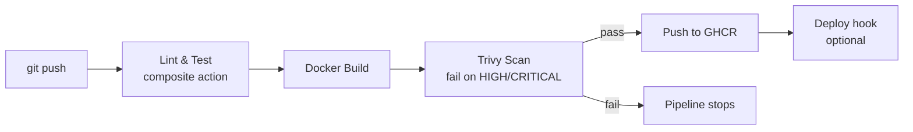

# ci-cd-toolkit

Reusable GitHub Actions composite actions for CI/CD: lint → test → build → vulnerability scan → push to registry → deploy. Applied here to three different app stacks (Node, Python, static HTML) to prove the toolkit is stack-agnostic, not a one-off pipeline.

## Why this exists

Most portfolio CI/CD projects are a single `.yml` file wired to a single app. This repo packages the pipeline logic as **standalone, reusable composite actions** (`.github/actions/`) that any repo — not just this one — can pull in with a single `uses:` line. The three `examples/` apps exist only to prove the actions work across different languages and app types.

## Architecture



## Repo layout

```
.github/
  actions/
    lint-and-test/              # generic lint+test wrapper, any language
    docker-build-scan-push/     # build -> Trivy scan -> push, reusable across repos
  workflows/
    node-api.yml                # calls both actions for the Node example
    python-api.yml              # calls both actions for the Python example
    static-site.yml              # calls build-scan-push only (no app logic to test)
examples/
  node-api/       # Express + Jest + ESLint
  python-api/      # Flask + pytest + flake8
  static-site/     # plain HTML behind nginx
```

## Using the actions in another repo

Because these are composite actions, any other repo can reference them directly without copy-pasting YAML:

```yaml
- uses: MakniAmin/ci-cd-toolkit/.github/actions/docker-build-scan-push@main
  with:
    image-name: your-org/your-app
    context: .
    registry-username: ${{ github.actor }}
    registry-password: ${{ secrets.GITHUB_TOKEN }}
```

That's the whole pitch: write the security-scanned build/push pipeline once, reuse it everywhere.

## Setup

1. Push this repo to GitHub as `ci-cd-toolkit`.
2. GHCR push works out of the box using the automatic `GITHUB_TOKEN` — no extra secrets needed for build/scan/push.
3. Confirm package visibility: Settings → Packages, or make the GHCR package public so the pushed images are viewable without auth (nice for a portfolio link).
4. **Deploy step is optional and off by default.** To enable it:
   - On Render (or any host with an HTTP deploy webhook): create a service that deploys the prebuilt image directly from the registry, e.g. `ghcr.io/makniamin/ci-cd-toolkit/node-api-demo:latest`, then copy its deploy-hook URL from the service's Settings page.
   - Set the repo variable `DEPLOY_ENABLED=true` (Settings → Secrets and variables → Actions → Variables).
   - Add a secret per app (`NODE_API_DEPLOY_HOOK`, `PYTHON_API_DEPLOY_HOOK`, `STATIC_SITE_DEPLOY_HOOK`) with the matching deploy-hook URL. Image-backed services generally don't auto-redeploy on a new image push, so this webhook is what actually triggers it — check whichever provider's current docs since this detail varies.
5. Push a change under `examples/node-api/` (or python-api, or static-site) and watch the matching workflow run end to end.

## Proving the security gate actually works

For the portfolio write-up, deliberately pin an old base image (e.g. `node:18.0-alpine` instead of `node:20-alpine`) in one Dockerfile, push, and screenshot the Trivy step failing the build. Then fix the base image and screenshot it going green. That before/after is a better interview story than a pipeline that only ever shows green.

## What each piece demonstrates

- **`lint-and-test` composite action** — CI fundamentals, language-agnostic design
- **`docker-build-scan-push` composite action** — containerization, Trivy/DevSecOps, GHCR
- **Three example apps** — proves reusability, not a one-off script
- **Deploy hook gate via repo variable** — conditional jobs, environment-based control
- **Mermaid architecture diagram in README** — communicates the pipeline at a glance to a recruiter skimming GitHub

## Case study: what actually happened

The value of this project isn't that the pipeline is green — it's the debugging trail that got it there. Every step below is a real issue this pipeline caught while being built, not a staged demo.

1. **Missing lockfile.** `npm ci` failed immediately with no `package-lock.json` present. `npm ci` only works because it trusts an exact, committed lockfile instead of resolving versions itself — so the fix was generating and committing that file, not switching to the looser `npm install`.

2. **End-of-life base image.** The image built fine on `node:20-alpine`, but Node.js 20 reached end-of-life on April 30, 2026 — three months before this build ran. Bumped to `node:22-alpine` (Maintenance LTS, supported through April 2027).

3. **Real CVEs, correctly triaged, not just suppressed.** Trivy still failed the build after the base image bump — 6 CVEs (5 HIGH, 1 CRITICAL) across `tar`, `sigstore`, `picomatch`, and `brace-expansion`. All of them traced back to `usr/local/lib/node_modules/npm/...` — the base image's *own bundled npm CLI*, not this app's dependencies (which scanned clean at 0). Since the container's `CMD` only ever runs `node index.js` and never invokes `npm`, the fix was a multi-stage build that strips the npm/npx/corepack toolchain from the final runtime image entirely — removing the actual attack surface instead of just telling Trivy to ignore the finding.

| Before | After |
|---|---|
|  |  |

*(Add your two screenshots to a `docs/` folder in this repo with those exact filenames — the failing run shows `Total: 6 (HIGH: 5, CRITICAL: 1)`, the passing run shows a clean scan table.)*

## License

MIT
